# 🌍 Multilingual Translator & Summariser


> **Break language barriers and information overload in one click.**  
> An AI-powered tool that automatically detects any language, translates it to English, and generates a concise summary.

---

## 📜 Table of Contents

- [Problem & Solution](#-problem--solution)
- [✨ Key Features](#-key-features)
- [🏗️ System Architecture](#-system-architecture)
- [📦 Technology Stack](#-technology-stack)
- [🛠️ Code Implementation](#-%EF%B8%8F-code-implementation-details)
- [🚀 Installation & Setup](#-installation--setup)
- [🧠 Managing AI Models](#-managing-ai-models)
- [🤝 Deployment](#-deployment)

---

## ❓ Problem & Solution

### The Challenge

- **Language Barrier:** Accessing information in foreign languages is difficult.
- **Information Overload:** Even translated documents can be too long to read quickly.
- **Workflow Friction:** Using separate tools for translation and summarization is tedious.

### The Solution

A unified, intelligent interface where you simply **paste text in any language**. The system handles the rest:

1.  **Detects** the source language.
2.  **Translates** it to fluent English.
3.  **Summarizes** the key points for you.

---

## ✨ Key Features

| Feature                | Description                                                                                      |
| :--------------------- | :----------------------------------------------------------------------------------------------- |
| **🌐 Polyglot Input**  | Accepts text in **200+ languages** (French, Hindi, Spanish, Chinese, etc.).                      |
| **🤖 SOTA AI Models**  | Uses **NLLB-200** for accurate translation and **BART-Large-CNN** for abstractive summarization. |
| **⚡ Real-time UI**    | Built with **Gradio** for an instant, responsive web experience.                                 |
| **📦 Offline Capable** | Models run locally on your machine after the first download.                                     |

---

## 🏗️ System Architecture

### Application Workflow

```mermaid
graph LR
    User[👤 User Input] --> UI[🖥️ Gradio Interface]
    UI --> Trans[🌍 Translation Module]

    subgraph "Core Choice Logic"
    Trans -- "NLLB-200 Model" --> Eng[Text in English]
    Eng --> Summ[📝 Summarization Module]
    Summ -- "BART-Large-CNN" --> Final[Generates Summary]
    end

    Eng --> UI
    Final --> UI
    UI --> Display[👀 Final Output]
```



### Folder Structure

```bash
Multilingual-Translator-Summariser/
├── app.py                 # 🚀 Entry Point (UI & Orchestration)
├── requirements.txt       # 📋 Dependencies
├── README.md              # 📘 Documentation
└── src/                   # 🧠 Core Logic
    ├── translation.py     # NLLB-200 Wrapper
    └── summarization.py   # BART-Large Wrapper
```

---

## 📦 Technology Stack

We use industry-standard libraries to ensure reliability and performance.

| Library           |                                                Badge                                                | Purpose                                          |
| :---------------- | :-------------------------------------------------------------------------------------------------: | :----------------------------------------------- |
| **Transformers**  |  | Provides access to pre-trained SOTA models.      |
| **PyTorch**       |      | The Deep Learning computation engine.            |
| **Gradio**        |         | Creates the web-based user interface.            |
| **SentencePiece** |      | Text tokenizer required for multilingual models. |

---

## 🛠️ Code Implementation Details

Here is how the magic happens inside the code (`src/` folder):

### A. Translation Module (`src/translation.py`)

- **Model Used:** `facebook/nllb-200-distilled-600M`
- **Logic:**
  - The model accepts text in over 200 languages.
  - We specifically tell the model to output **English** using the `forced_bos_token_id` for "eng_Latn".
  - **Function:** `translate_text(text)` takes raw foreign text -> outputs English.

### B. Summarization Module (`src/summarization.py`)

- **Model Used:** `facebook/bart-large-cnn`
- **Logic:**
  - This model is an expert at reading long articles and rewriting them simply.
  - It uses "Abstractive Summarization" (writing new sentences) rather than just "Extractive" (copy-pasting sentences).
  - **Function:** `summarize_text(text)` takes English text -> outputs a short summary.

### C. Application Interface (`app.py`)

- This is the **Orchestrator**.
- It uses **Gradio** to build the website you see.
- **Workflow:**
  1.  User clicks "Process".
  2.  `app.py` sends text to `translation.py`.
  3.  `app.py` sends the result to `summarization.py`.
  4.  Both results are shown on screen.

---

## 🚀 Installation & Setup

### 1. Prerequisites

- Python 3.8 or higher
- Git

### 2. Setup Guide

> **💡 Pro Tip:** We use a **Virtual Environment (.venv)**. This is a "sandbox" that keeps your project dependencies separate from your computer, preventing conflicts.

```powershell
# 1. Clone or create directory
mkdir Multilingual-Translator-Summariser
cd Multilingual-Translator-Summariser

# 2. Create Virtual Environment
python -m venv .venv

# 3. Activate Environment (Windows)
& .venv/Scripts/Activate.ps1

# 4. Install Dependencies
pip install -r requirements.txt
```

### 3. Run the Application

```powershell
python app.py
```

- The first run will download models (~4GB). **Please be patient!** ⏳
- Once ready, open: `http://127.0.0.1:7860`

---

## 🧠 Managing AI Models

Models are stored in your global cache, not in the project folder. This saves space if multiple projects use the same model.

| Model Name                         | Size    | Function                             |
| :--------------------------------- | :------ | :----------------------------------- |
| `facebook/nllb-200-distilled-600M` | ~2.5 GB | Translates 200 languages to English. |
| `facebook/bart-large-cnn`          | ~1.6 GB | Summarizes long English text.        |

### 🗑️ Cleaning Up (Free up Space)

To delete models after you are done:

```powershell
# 1. Open Terminal in project folder
# 2. Run the cleanup tool
huggingface-cli scan-cache

# 3. Follow instructions to select and delete models
```

---

## 🤝 Deployment

This app is **Cloud-Ready** for Hugging Face Spaces.

1.  Create a new Space at [huggingface.co/spaces](https://huggingface.co/spaces).
2.  Select **Gradio** as the SDK.
3.  Upload `app.py`, `src/`, and `requirements.txt`.
4.  **Done!** Your app is live on the web.

---

## 🔮 Future Roadmap

- [ ] 🎙️ **Voice Input:** Add Whisper model for Speech-to-Text.
- [ ] ⚡ **Optimization:** Quantize models to run faster on generic CPUs.
- [ ] 💾 **History:** Save past translations to a local database.

---

_Built with ❤️ using Open Source AI._
